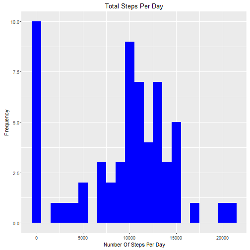
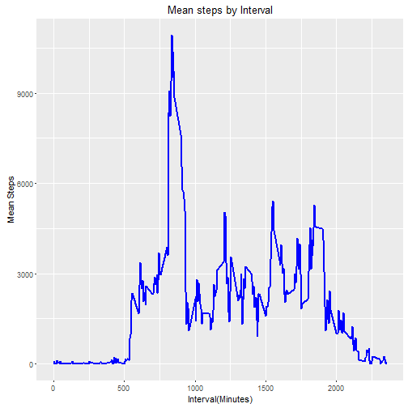
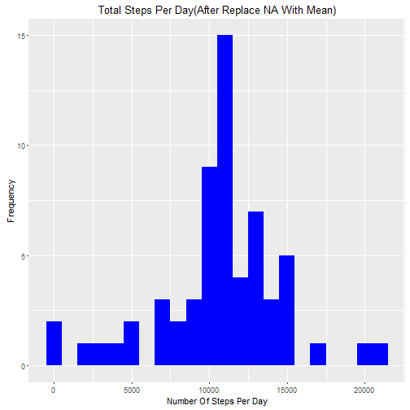
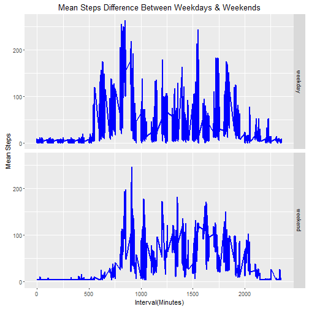

## Loading necessary lib
library(ggplot2)

library(lattice)

library(knitr)

## Loading and preprocessing the data
data<-read.csv("./RepData_PeerAssessment1/activity.csv",stringsAsFactors = F)

data$date <- as.Date(data$date, format = "%Y-%m-%d")

## What is mean total number of steps taken per day?
sum_data <- aggregate(data$steps, by=list(data$date), FUN=sum, na.rm=TRUE)

names(sum_data)<-c("Date","TotalSteps")

```r
ggplot(sum_data,aes(x=TotalSteps))+geom_histogram(fill="blue",binwidth = 1000)+labs(title="Total Steps Per Day",x="Number Of Steps Per Day",y="Frequency")
```



meanData<-mean(sum_data$TotalSteps)

medianData<-median(sum_data$TotalSteps)

## What is the average daily activity pattern?
mean_data <- aggregate(data$steps, by=list(data$interval), FUN=sum, na.rm=TRUE)

names(mean_data)<-c("Interval","MeanSteps")

```r
ggplot(mean_data,aes(x=Interval,y=MeanSteps))+geom_line(color="blue",size=1)+labs(title="Mean steps by Interval",x="Interval(Minutes)",y="Mean Steps")
```



max_mean<-which(mean_data$MeanSteps==max(mean_data$MeanSteps))

max_interval <- mean_data[max_mean, 1]

## Inputing missing values
valueNA<-sum(is.na(data$steps))

valueNA_locate <- which(is.na(data$steps))

mean_NAvec <- rep(mean(data$steps, na.rm=TRUE), times=length(valueNA_locate))

data[valueNA_locate, "steps"] <- mean_NAvec

sum_data2 <- aggregate(data$steps, by=list(data$date), FUN=sum)

names(sum_data2)<-c("Date","TotalSteps")

```r
ggplot(sum_data2,aes(x=TotalSteps))+geom_histogram(fill="blue",binwidth = 1000)+labs(title="Total Steps Per Day(After Replace NA With Mean)",x="Number Of Steps Per Day",y="Frequency")
```



meanData2<-mean(sum_data2$TotalSteps)

medianData2<-median(sum_data2$TotalSteps)


## Are there differences in activity patterns between weekdays and weekends?
data$weekday <- weekdays(as.Date(data$date))

data_week <- cbind(data,daytype=ifelse(data$weekday == "Saturday" | data$weekday == "Sunday", "weekend","weekday"))

mean_week <- aggregate(data_week$steps,by=list(data_week$daytype,data_week$weekday, data_week$interval), mean)

names(mean_week)<-c("daytype","weekday","interval","mean")

```r
ggplot(mean_week,aes(x=interval,y=mean))+geom_line(color="blue",size=1)+facet_grid(daytype ~ .) +
labs(title="Mean Steps Difference Between Weekdays & Weekends",x="Interval(Minutes)",y="Mean Steps")
```


